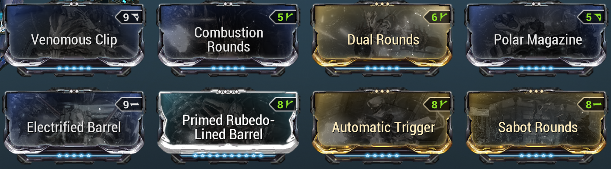

# Operation: Orphix Venom
In this operation, we have to defeat sentients that have developed the ability to disable warframes.
In order to do this, we shoot things with our necramechs and operators.

# Basic Gameplay
Shortly after mission start and every 1m30s after that, an Orphix will spawn with a large radius around it that prevents
warframe use. It spawns a variety of other sentients and Orphix Resonators. Until all Orphix Resonators are destroyed,
the Orphix will remain invulnerable. Each Orphix spawns two waves of resonators - once when it spawns and once at 50%
health. You need to do this fast enough so that sentient control does not reach 100%. Killing resonators and sentients
reduces sentient control and finishing off the Orphix reduces it back to 0% (unless the next one spawned already).

1. Load into mission, wait for Orphix to spawn
2. Take out first wave of Orphix Resonators
3. Reduce Orphix to 50% health
4. Take out second wave of Orphix Resonators
5. Kill Orphix
6. Repeat until you killed 36 (you could extract after killing 3)

# Rotations
The operation follows the common AABC loot rotation. Every 3 destroyed Orphix give you a reward.
This means 12, 24 and 36 destroyed Orphix reward the C rotation. You will see many pub runs want to extract at round 12.

# Loadout
## Warframe
Protea with duration and power strength to put down dispensary for mech energy.

## Necramech
- Voidrig with [Necramech Rage] and [Necramech Repair]
- Arquebex modded for corrosive

## Archgun
Fluctus with raw damage (stolen from --RV--Faras)

The complete lack of crit chance and crit damage is intentional, as you can't crit the resonators.

## Operator
Unairu with Void Shadow and Void Chrysalis

## Amp
X44
- Phahd (4) Scaffold is to one-shot the resonators
- Anspatha (4) Brace gives +20 energy and +15/s energy recharge rate to make going around the map more efficient. We don't use the Certus brace here, because you get crits against resonators.

If you build an amp for this, i recommend the 444 (commonly used for PT) or 644 (my personal "general use" preferance).

## Primary/Secondary/Melee
Does not matter.

# Spawn Locations
1, 2 and 3 refer to the room where the first, second and third Orphix spawned.
- Grineer Map Rotation: (123) and then it repeats  312 / 213
- Corpus Map Rotation: (123) and then it repeats  321 / 123

There also seems to be a lower chance of a spawn rotation that is random or we haven't figured out yet.

# Optimizations
## Points
There are two sources of points: Passive (while no Orphix is present) and by killing sentients.

The main source of your total score will be from Orphix kills and passive points.
Killing other sentients that spawn gives only 2 per kill, so it is not worth to focus on that.

To maximize your points, You should focus on killing the Orphix as quickly as possible.

## Positioning
Learn the spawn rotations and remember the where the 1/2/3 rooms are. Keeping the HUD map open helps with this.
Positioning is important to quickly get started with killing the Orphix as soon as it spawns.

## Destroying Orphix Resonators
### Option 1: Fluctus
The fluctus has 55m punch through. This means it can shoot through walls!
Aim at the target markers for the resonators and destroy them without having line of sight.
If a marker is at a door, the resonator might be a bit harder to hit. Look at the minimap, shoot at spots left/right of
the door at possible locations (which you can guess from general tile layout), or switch to option 2.

### Option 2: Operator/Amp
This is where the X44 amp comes into play. Use your operator to quickly dash around and destroy resonators with one hit
of the Phahd scaffold (alt fire). This is the same thing as is used in Zenith-less PT runs.

Getting around with the operator is way easier than in the mech, especially if you have the relevant waybounds unlocked.
Being in operator and dashing around, also protects your teammates with Void Shadow and Void Chrysalis.

## Other
- Make sure to cast dispensary for the mechs to regen energy before the next Orphix spawns
- 